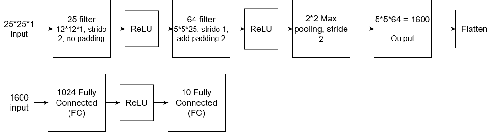
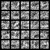

# CNN-MNIST-dataset
A CNN for classify MNIST dataset, number 0-9
test set and train set according to the dataset itself.

You need torch, torchvision and matplotlib to run the program, recommand to have cuda support device.
Run the program, it will first download the data and train itself for 4 epoch
\n
It will then test accuracy, it can achieve around around 98% (98.74% as i tested) of accuracy.
At the end of the program, it will extract the first convolutional layer and visualize it, then asve a .png at same root.

# Structure of the CNN and classifier
 

# first convolutional layer visualization
 

# Reference
Structure of CNN reference to https://www.cs.ox.ac.uk/people/varun.kanade/teaching/ML-MT2016/practicals/practical3.pdf
